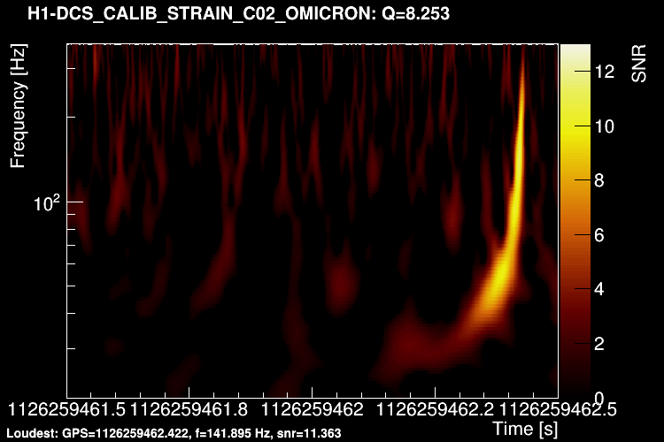

# GravitationalWaves

## Contributors
[Florent Robinet](mailto:florent-robinet@ijclab.in2p3.fr)
[Jean-Gregoire Ducoin](mailto:ducoin@lal.in2p3.fr)

## Scope of the project

This project is about impementing some basic algorithms used to search for gravitational waves in the data of interferometric detectors, such as the LIGO and Virgo detectors. To test the code, we will use the data set associated to the first detection of a gravitational wave event in LIGO detectors: GW150914. This event originated from the merger of a binary black hole system.

This project is divided into two parts:
- The first part is about developing a code to process the LIGO strain time series. This idea is to implement some basic technics in signal processing such as noise estimation, noise whitening, and short Fourier transforms. The final result will be to plot the spectrogram of GW150914 to visualize the gravitational-wave signal.
- The second part of the project is about performing the data analysis which led to the discovery of GW150914. Starting from a list of triggers from the two LIGO detectors, a coincident analysis must be developed as well as a noise estimation. 

## Documentation

- [GW150914 discovery paper](https://journals.aps.org/prl/abstract/10.1103/PhysRevLett.116.061102)
- [Method note](./doc/method/signal.pdf): the signal analysis is presented in a short note.
- [ROOT](https://root.cern/) libraries are used as a tool box to perform analyses. See also the [C++ class documentation](https://root.cern.ch/doc/master/index.html)
- Fourier transforms are performed with [FFTW](http://www.fftw.org/). See also the [documentation](http://www.fftw.org/fftw3_doc/).
- [qsort algorithm](http://www.cplusplus.com/reference/cstdlib/qsort/)

## Data sets

- `./data/GW150914/?1.data.root`: LIGO time series data, sampled at 1024 Hz) around the time of GW150914 (GPS = 1126256640 to 1126260736). Hanford (H1) and Livingston (L1) data are saved separately in ROOT files as [TGraph](https://root.cern.ch/doc/master/classTGraph.html) object.

## Project 1: GW150914 spectrogram

- use the LIGO time series data in `./data/GW150914/?1.data.root`
- play with FFTW to Fourier-transform the time series
  - plot the full array of coefficients after the Fourier transform.
  - plot the entire data set in a single graph and compute the spectrum.
- compute the power spectrum density (PSD) using a robust estimator
- whiten the time series
- tile the time-frequency plane
- develop a function to compute the bisquare window for each tile
- project the data onto each time-frequency tile and compute the SNR
- plot the final result

### Chapter 1: the data and the Fourier transform

- Run the `spectrum` code and get familiar with the output plots.
Compare the spectrum with the LIGO sensitivity plot in the
[GW150914 discovery paper](https://journals.aps.org/prl/abstract/10.1103/PhysRevLett.116.061102).
What's wrong?
- Use a Hann window to correct for the spectral leakage.
- Normalize your spectrum to recover the LIGO sensitivity plot in the
[GW150914 discovery paper](https://journals.aps.org/prl/abstract/10.1103/PhysRevLett.116.061102).
- Play with the code parameters: length of the Fourier transform...
- Plot the spectrum including the negative frequencies.
- Perform a BACKWARD Fourier transform and check that the original signal is recovered.

### Chapter 2: the noise power spectral density (PSD)

- Prepare your code to compute a spectrum over 2 seconds of data.
- Loop over the data to compute a spectrum over a segment of 2 seconds overlapping the previous segment by 1 second.
- Check for the Welch method to estimate a power spectral density (PSD).
How can you modify this method to have a PSD estimator which is unbiased by outliers.
- Finally, average 2 PSD estimates, each of them estimated on non-overlapping segments.
- Plot the final PSD on top of all the 4-seconds estimates.
- Save your final PSD in a file (for both detectors!)

### Chapter 3: the data whitening

Now, let's start the data analysis and search for gravitational-wave events.
Start a new code from scratch to perform the following analysis steps:
- Loop over the data using 4-seconds long segments, overlapping by 1 second.
- Apply a Tukey window to transition from 0 to 1 in 1 second.
- Fourier-transform the data
- Remove frequencies below 20 Hz.
- Whiten the data with the PSD, using the PSD you saved in the previous chapter.
- Plot the whiten data in the frequency domain (spectrum). Is it what you expect?
- Fourier-transform the data back in the time domain. Can you "see" GW150914?

### Chapter 4: tiling the parameter space

Before applying the Q transform, the time-frequency plane needs to be tiled.
For this, we will refer to the [Method note](./doc/method/signal.pdf).
- Develop a class to descibre a multi-resolution tiling:
  - the resolution is defined by a given Q value and a mismatch between the tiles (constructor)
  - use a simple grid: logarithmically-spaced frequency rows, and linearly-distributed time bins.
  - map the tiles onto the grid
  - develop the functions to access/fill the tiles

### Chapter 5: the Q transform

- Prepare the bisquare window for each frequency row.
- Prepare the normalization factor for each frequency row.
- Fill the input vector
- Perform the inverse Fourier transform for each row.
- Fill your tiling structure,
- save your final spectrogram.

